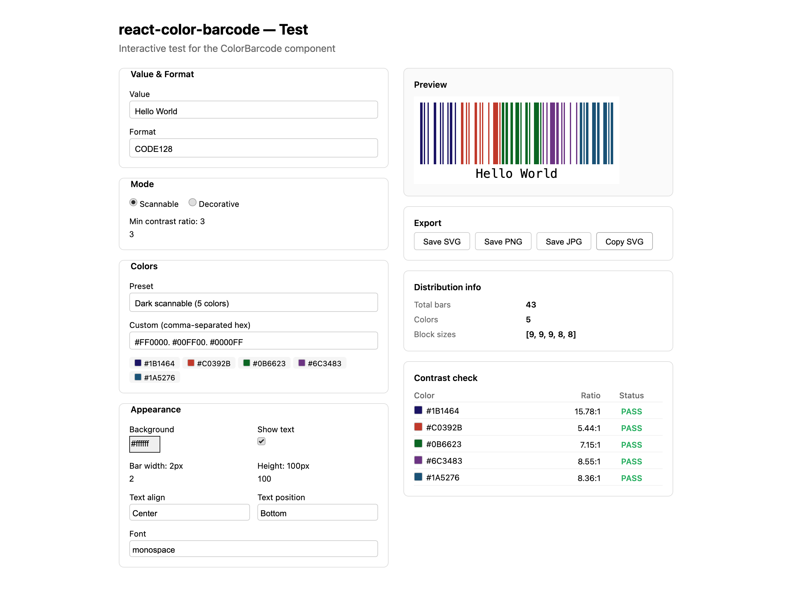

# react-color-barcode
The first React barcode component with **per-bar coloring**. Generate barcodes where each bar can be a different color — for branding, decoration, or artistic use — while optionally enforcing scannability through built-in contrast validation.


## Demo


The package includes an interactive demo app for testing all features. To run it:

```bash
git clone https://github.com/Hufnagels/react-color-barcode.git
cd react-color-barcode
npm install
npm run dev

```
Open `http://localhost:4173` in your browser. The demo lets you:

- **Change the barcode value and format** — try CODE128, CODE39, EAN13, UPC, and more
- **Switch between scannable and decorative mode** — scannable mode blocks low-contrast colors with a clear error; decorative mode allows any colors
- **Pick color presets or enter custom colors** — 6 built-in presets from dark scannable to light pastel (which intentionally fails contrast checks)
- **Adjust appearance** — bar width, height, background color, show/hide text, text alignment (left/center/right), text position (top/bottom), and font family
- **Tune the contrast ratio slider** — see how different thresholds affect which colors pass or fail
- **Export the barcode** — Save SVG, Save PNG, Save JPG buttons download the barcode directly; Copy SVG puts the SVG markup on your clipboard
- **Inspect distribution info** — see how many total bars the encoding produces and how they're split across your colors
- **Check the contrast table** — every color is checked against the background with its WCAG contrast ratio and PASS/FAIL status

## What's new — features no other package has
| Feature | react-color-barcode | react-barcode | react-barcodes |
| --- | --- | --- | --- |
| Per-bar coloring | ✅ Sequential color blocks with smart distribution | ❌ Single lineColor only | ❌ Single color only |
| Scannable mode | ✅ WCAG contrast validation prevents unscannable output | ❌ No validation | ❌ No validation |
| Decorative mode | ✅ Any colors, with optional warnings | ❌ N/A | ❌ N/A |
| Export to SVG/PNG/JPG | ✅ Built-in via ref, no extra libraries | ❌ Not built-in | ❌ Not built-in |
| Contrast warnings | ✅ Per-color ratio reporting + callback | ❌ None | ❌ None |
| TypeScript | ✅ Written in TypeScript, full type exports | ⚠️ Community types | ⚠️ Basic types |
| forwardRef | ✅ Full ref API for export methods | ❌ No | ❌ No |
| All standard props | ✅ textAlign, textPosition, font, margins, flat, etc. | ✅ Yes | ⚠️ Partial |
| SVG rendering | ✅ Always SVG, crisp at any scale | ✅ SVG/Canvas/Image | ✅ SVG/Canvas/Image |
| Barcode formats | ✅ 20+ (CODE128, CODE39, EAN, UPC, ITF, MSI, etc.) | ✅ Same (jsbarcode) | ✅ Same (jsbarcode) |

## Why is it better?
1. **Color is the whole point.** Every other React barcode library gives you one `lineColor`. This package distributes an array of colors across bars in smart sequential blocks — no per-bar CSS hacking.
2. **Scannability built in.** Other packages let you set `lineColor: "yellow"` on a white background and silently produce an unscannable barcode. This package validates contrast ratios and throws in scannable mode, or warns in decorative mode.
3. **Export without extra code.** Call `ref.current.toPng()` or `ref.current.download('barcode.jpg')`. No need for html2canvas, dom-to-image, or manual SVG serialization.
4. **Smart color distribution.** The algorithm evenly distributes bars across colors with front-loaded remainders:
   ```plaintext
                     123 bars, 5 colors → [25, 25, 25, 24, 24]
                     10 bars, 3 colors  → [4, 3, 3]
                     
                  
               
            
         
      
   ```

## Install

```bash
npm install react-color-barcode

```

## Quick start

```tsx
import { ColorBarcode } from 'react-color-barcode';

function App() {
  return (
    <ColorBarcode
      value="Hello World"
      colors={['#1B1464', '#C0392B', '#0B6623', '#6C3483', '#1A5276']}
      height={120}
      width={2}
      showText
    />
  );
}

```

## Props
| Prop | Type | Default | Description |
| --- | --- | --- | --- |
| value | string | required | Data to encode |
| colors | string[] | required | Array of hex colors to distribute across bars |
| format | BarcodeFormat | 'CODE128' | Barcode format (CODE128, CODE39, EAN13, UPC, etc.) |
| mode | 'scannable' \'decorative' | 'scannable' | Scannable validates contrast; decorative allows any colors |
| background | string | '#FFFFFF' | Background / space color |
| minContrastRatio | number | 3 | Minimum contrast ratio for scannable mode |
| onContrastWarning | (results: ContrastResult[]) => void | — | Callback when colors fail contrast check (both modes) |
| width | number | 2 | Bar unit width in pixels |
| height | number | 100 | Bar height in pixels |
| showText | boolean | false | Show human-readable text |
| text | string | — | Override display text (defaults to value) |
| textAlign | 'left' \ 'center' \ 'right' | 'center' | Text horizontal alignment |
| textPosition | 'top' \ 'bottom' | 'bottom' | Text vertical position |
| textMargin | number | 2 | Gap between bars and text |
| textColor | string | '#000000' | Text color |
| font | string | 'monospace' | Font family |
| fontOptions | string | '' | 'bold', 'italic', or 'bold italic' |
| fontSize | number | 20 | Font size in pixels |
| flat | boolean | false | Hide text even when showText is true (useful for EAN/UPC) |
| margin | number | — | Shorthand for all margins (overrides individual) |
| marginTop | number | 10 | Top margin |
| marginBottom | number | 10 | Bottom margin |
| marginLeft | number | 10 | Left margin |
| marginRight | number | 10 | Right margin |
| id | string | — | SVG id attribute |
| className | string | — | SVG class attribute |
| style | CSSProperties | — | SVG inline styles |

## Scannable vs decorative mode

```tsx
// Scannable (default) — throws if yellow doesn't have enough contrast
<ColorBarcode
  value="123"
  colors={['#FFEAA7']}
  mode="scannable"
/>
// Error: Scannable mode: insufficient contrast. #FFEAA7 (ratio: 1.19)

// Decorative — renders anyway, optionally warns
<ColorBarcode
  value="123"
  colors={['#FFEAA7']}
  mode="decorative"
  onContrastWarning={(results) => {
    console.warn('Low contrast:', results);
  }}
/>

```

## Export / save
Use a ref to export the barcode as SVG, PNG, or JPG:

```tsx
import { useRef } from 'react';
import { ColorBarcode } from 'react-color-barcode';
import type { ColorBarcodeRef } from 'react-color-barcode';

function ExportExample() {
  const barcodeRef = useRef<ColorBarcodeRef>(null);

  const handleExport = async () => {
    if (!barcodeRef.current) return;

    // Get SVG string
    const svgString = barcodeRef.current.toSvg();

    // Get PNG blob (2x scale by default)
    const pngBlob = await barcodeRef.current.toPng();

    // Get JPG blob with custom scale and quality
    const jpgBlob = await barcodeRef.current.toJpg(3, 0.95);

    // Get data URL (for )
    const dataUrl = await barcodeRef.current.toDataURL('png', 2);

    // Download directly
    await barcodeRef.current.download('my-barcode', 'png', 2);
    await barcodeRef.current.download('my-barcode', 'svg');
    await barcodeRef.current.download('my-barcode', 'jpg', 3);
  };

  return (
    <div>
      <ColorBarcode
        ref={barcodeRef}
        value="EXPORT-ME"
        colors={['#E74C3C', '#3498DB', '#2ECC71']}
        mode="decorative"
        showText
      />
      <button onClick={handleExport}>Export</button>
    </div>
  );
}

```

## Color distribution algorithm
Colors are distributed in sequential blocks across bars:

```tsx
// 5 colors across a barcode with 43 bars:
// Color 1: bars 1–9   (9 bars)
// Color 2: bars 10–18  (9 bars)
// Color 3: bars 19–27  (9 bars)
// Color 4: bars 28–35  (8 bars)
// Color 5: bars 36–43  (8 bars)
//
// Formula: base = floor(43/5) = 8, remainder = 3
// First 3 colors get 9 bars, last 2 get 8 bars

```
Only actual bars (dark lines) are counted. Spaces between bars always use the background color.

## Contrast validation utilities
The contrast checking functions are exported for standalone use:

```tsx
import { validateColors, allColorsScannable, contrastRatio } from 'react-color-barcode';

// Check a single pair
const ratio = contrastRatio('#C0392B', '#FFFFFF'); // 5.72

// Validate an array
const results = validateColors(['#1B1464', '#FFEAA7'], '#FFFFFF', 3);
// [{ color: '#1B1464', ratio: 14.73, pass: true },
//  { color: '#FFEAA7', ratio: 1.19, pass: false }]

// Quick boolean check
const scannable = allColorsScannable(['#1B1464', '#C0392B'], '#FFFFFF'); // true

```

## Supported formats
CODE128, CODE128A, CODE128B, CODE128C, CODE39, EAN13, EAN8, EAN5, EAN2, UPC, UPCE, ITF, ITF14, MSI, MSI10, MSI11, MSI1010, MSI1110, pharmacode, codabar, CODE93

## License
MIT